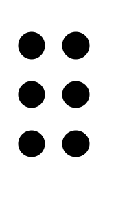

# Grafia Braille para a Língua Portuguesa

## Nota Introdutória

O presente manual elaborado pela Comissão de Braille, adaptado e transcrito pelo Centro de Recursos do Núcleo de Orientação Educativa e de Educação Especial do Departamento da Educação Básica, pelo seu carácter inovador, constitui um marco importante no desenvolvimento do ensino e da divulgação do Sistema Braille como meio natural de leitura e escrita das pessoas cegas.

Sendo um instrumento valioso para todos os profissionais que trabalham com crianças, jovens e adultos cegos, a sua utilização constitui uma mais valia de grande relevância na formação especializada e contínua de professores.

Importa ainda realçar o facto de este manual constituir um elemento de reforço da lusofonia e da aproximação entre povos que falam a mesma língua.

## Prefácio

A 3ª edição de Grafia Braille para a Língua Portuguesa (denominada nas anteriores edições "Compêndio de Grafia Braille da Língua Portuguesa", que a Comissão de Braille agora põe à disposição do público, surge como uma realização no âmbito do Protocolo de Colaboração outorgado pela Comissão de Braille e pela Comissão Brasileira do Braille, reflecte o consenso alcançado nas suas reuniões conjuntas de Lisboa (26 e 27 de Maio de 2000) e de Salvador da Bahia (10 e 11 de Setembro de 2001), aperfeiçoado noutros contactos, e passa a constituir o instrumento braillográfico de referência para a língua portuguesa.

Os objectivos que nortearam a elaboração desta edição, consistiram na actualização de alguns conceitos do domínio da braillística, no alargamento da representação braillográfica a certos símbolos que passaram a ocorrer com maior frequência, na reorganização da matéria em unidades de informação mais coerentes, na habilitação dos interessados no emprego correcto dos códigos braille espanhol e inglês e na inclusão de um apêndice com símbolos e regras a usar em contexto informático.

Por outro lado, não foi descurada a função normativa, pelo que esta Grafia mantém um conjunto de instruções/recomendações destinadas a evitar ambiguidades e a assegurar à leitura a necessária e desejável espontaneidade. Foram também conservados os apêndices (antes denominados "anexos") em que figuram alfabetos de outras línguas e conjuntos de símbolos braille diferentes do português, mas considerados de interesse para os utilizadores do braille em língua portuguesa, bem como os índices da anterior edição, convenientemente revistos.

Espera-se, deste modo e em sintonia com o esforço internacional de uniformização signográfica em curso na área ibero-americana, ter contribuído para tornar possível a circulação, nos países de língua portuguesa, de edições em braille cuja grafia se apresenta uniformizada, para o enriquecimento da perspectiva gráfica dos leitores e, ao mesmo tempo, para os estimular a atingir um grau mais elevado de agilidade na leitura.

## Introdução

A grafia braille da língua portuguesa consiste no conjunto do material signográfico e das instruções/recomendações orientadoras da sua utilização na escrita. O conhecimento completo do respectivo código e a sua correcta utilização devem constituir um objectivo permanente para todos, porque a boa qualidade gráfica dos textos exerce nos leitores uma saudável influência educativa, facilitando a assimilação de padrões propiciadores da melhoria do nível de desempenho, quer na leitura quer na escrita. A matéria desta Grafia está exposta em três capítulos, que compreendem 56 secções, e em quatro apêndices.

O primeiro capítulo, "Sistema Braille", integra 7 secções. Nelas se define e apresenta este Sistema, assim como se procede à sua caracterização. O segundo capítulo, "O Código Braille para a Grafia da Língua Portuguesa", é composto por duas partes. A primeira, "Valor dos Sinais", inclui apenas a secção 8, em que se apresentam os quadros do material signográfico. A segunda parte, "Observações e Normas de Aplicação", estende-se da secção 9 à 44 e incorpora as regras que enquadram o emprego dos sinais constantes dos quadros apresentados na secção 8, contém alguns diacríticos necessários à escrita de palavras em outras línguas e de algumas palavras portuguesas e insere recomendações sobre a criação de sinais não previstos nesta Grafia. O terceiro capítulo, "Disposição do Texto Braille", expõe, da secção 45 à 56, as normas sobre esta matéria. Vários exemplos ajudam a interpretar as normas e ilustram a sua aplicação.

Os quatro apêndices completam esta publicação. No primeiro está incluído um conjunto de símbolos e regras referentes à escrita braille em contexto informático. O segundo apêndice apresenta conjuntos de símbolos braille empregados em alemão, dinamarquês, espanhol, francês, inglês, italiano, latim e sueco, não coincidentes com os portugueses ou inexistentes na língua portuguesa. No terceiro encontram-se os alfabetos grego, hebraico e russo ou cirílico moderno. O último apêndice contém alguns sinais convencionais usados em esperanto e noutras línguas.

Os índices de significados e de significantes, que não abrangem os apêndices, remetem o leitor para as secções em que é tratada a matéria respectiva, indicando as páginas correspondentes.

## Capítulo I - Sistema Braille

### 1. Definição

O sistema de escrita em relevo conhecido pelo nome de «Braille» estrutura-se a partir das combinações dos seis pontos  (1,2,3,4,5,6). [nota de rodapé] Os pontos da mesma célula são separados por vírgulas. Quando se utiliza mais que uma célula, estas são separadas por ponto e vírgula. [fim de nota] Este conjunto matricial denomina-se, por isso, sinal fundamental.

O espaço ocupado por qualquer destas combinações é denominado célula braille ou, no Brasil, cela braille. O Sistema Braille dispõe, pois, de 64 sinais, incluindo o espaço vazio.

### 2. Identificação dos pontos

Para facilmente se identificarem e se estabelecer exactamente a sua posição relativa, os pontos são numerados de cima para baixo e da esquerda para a direita. Os três pontos que formam a fila vertical esquerda [nota de rodapé] Em casos como este surgirá a representação com pontos braille seguida do sinal a tinta, na mesma posição relativa ou na linha de baixo [fim de nota], pontos 123 l, têm os números 1, 2, 3; aos que compõem a fila vertical direita, pontos 456 |, cabem os números 4, 5, 6.

### 2.1. os números dos pontos dos sinais braille escrevem-se consecutivamente, com o sinal de número apenas antes do número referente ao primeiro ponto de cada célula.

Exemplos:

p (1,2,3,4) = pontos 1234 pontos 126pontos 3456pontos 1pontos 2pontos 12pontos 2pontos 14pontos 2pontos 145pontos 345 (letra p)

ô (1,4,5,6) = pontos 1456 pontos 126pontos 3456pontos 1pontos 2pontos 145pontos 2pontos 15pontos 2pontos 124pontos 345 (letra o circunflexo)

ü (1,2,5,6) = pontos 1256 pontos 126pontos 3456pontos 1pontos 2pontos 12pontos 2pontos 15pontos 2pontos 124pontos 345 (letra u trema)

t (2,3,4,5) = pontos 2345 pontos 126pontos 3456pontos 12pontos 2pontos 14pontos 2pontos 145pontos 2pontos 15pontos 345 (letra t)

ã (3,4,5) = pontos 345 pontos 126pontos 3456pontos 14pontos 2pontos 145pontos 2pontos 15pontos 345 (letra a til)

o (1,3,5) = pontos 135 pontos 126pontos 3456pontos 1pontos 2pontos 14pontos 2pontos 15pontos 345 (letra o)

< (2,4,6) = pontos 246 pontos 126pontos 3456pontos 12pontos 2pontos 145pontos 2pontos 124pontos 345 (sinal de menor que)

g (1,2,4,5) = pontos 1245 pontos 126pontos 3456pontos 1pontos 2pontos 12pontos 2pontos 145pontos 2pontos 15pontos 345 (letra g)

â (1,6) = pontos 16 pontos 126pontos 3456pontos 1pontos 2pontos 124pontos 345 (letra a circunflexo)

I (4,6;2,4) = pontos 46pontos 24 pontos 126pontos 3456pontos 145pontos 2pontos 124pontos 23pontos 12pontos 2pontos 145pontos 345 (letra i maiúscula)

x (1,3,4,6) = pontos 1346 pontos 126pontos 3456pontos 1pontos 2pontos 14pontos 2pontos 145pontos 2pontos 124pontos 345 (letra x)

eu (1,5;136) = pontos 15pontos 136 pontos 126pontos 3456pontos 1pontos 2pontos 15pontos 23pontos 1pontos 14pontos 124pontos 345 (primeira pessoa do singular, eu)

2.2. Uma célula vazia é identificada pelo cardinal 0  pontos 3456pontos 245.

Exemplos: O sinal de igualdade = (2,3,5,6), entre palavras, deve ser representado entre células vazias. Assim "vermelho = encarnado" ficará em braille:  pontos 1236pontos 15pontos 1235pontos 134pontos 15pontos 123pontos 125pontos 135espaçopontos 3456pontos 245pontos 2356pontos 3456pontos 245espaçopontos 15pontos 1345pontos 14pontos 1pontos 1235pontos 1345pontos 1pontos 145pontos 135 (0;2,3,5,6;0).
