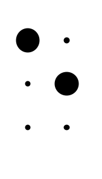

# Braille

Isto é braille!

 
 
 
 
 
 
 

Vamos lá começar a trabalhar (ehhh!...):

<ul>
 <li>Vamos começar por recuperar a <a href="/Braille/grafia/">grafia braille da língua portuguesa (trabalho em curso e ainda muito atrasado)</a> | por incrível que pareça, ainda não temos uma grafia braille consultável quer por pessoas normovisuais quer por pessoas cegas ou com baixa visão, em formato digital. Vamos fazer isso! Vou :-)</li>
 <li>Como posso escrever em Braille nos meus documentos? Bom, já ensinei ao chatGPT que pode escrever braille usando a tabela UNICODE. Foi a única coisa que lhe consegui ensinar. Mas para quem quiser escrever braille já, sem grandes complicações técnicas, pode usar o meu método, usando imagens PNG que estão na pasta /Cell deste repositório. São 63 carateres. Quando tiver tempo darei nota de como escrever braille - para já, fica o exemplo acima.</li>
</ul>

Got it!?
